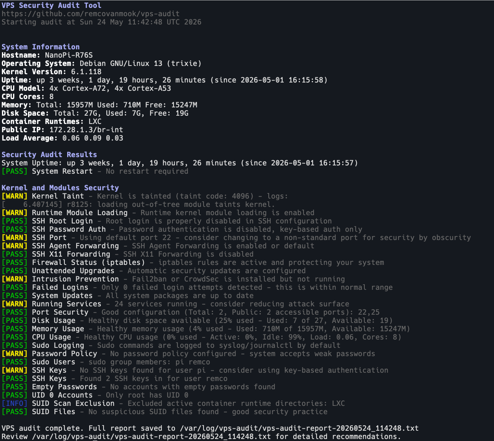

# VPS Security Audit Script

A comprehensive Bash script for auditing the security and performance of your VPS (Virtual Private Server). This tool performs various security checks and provides a detailed report with recommendations for improvements.

<!-- add a screenshot of the output here -->


## Features

### Security Checks

- **SSH Configuration:**
  - Root login status (using active config via `sshd -T`)
  - Password authentication status
  - Agent and X11 forwarding permissions
  - Non-default and unprivileged port usage
- **Firewall Status:** Detection and active status check for UFW, Firewalld, iptables, and nftables
- **Intrusion Prevention:** Status checks for active Fail2ban or CrowdSec installations
- **Failed Login Attempts:** Auditing `/var/log/auth.log` or `/var/log/secure`
- **System Updates Status:** Pending security updates count
- **Running Services Analysis:** Total count of active systemd/rc services
- **Open Ports Detection:** Checks listening sockets via `ss` (preferred) or `netstat`
- **Sudo Logging Configuration:** Audits `/etc/sudoers` and `/etc/sudoers.d/*`
- **Password Policy Enforcement:** Verifies pwquality configuration `/etc/security/pwquality.conf`
- **User Database Integrity:** Scans for accounts with empty passwords in `/etc/shadow` and audits for duplicate UID 0 accounts in `/etc/passwd`
- **SUID Files Detection:** Checks for suspicious SUID files, verifying MD5 checksums against the system package database (excluding active container directories)
- **Kernel Security & Modules:** Audits kernel taint logs, post-boot runtime module loading disablement, and forced module signature verification

### System Information & Performance

- Multi-distribution OS detection (Debian/Ubuntu, RHEL/CentOS/Fedora, and Alpine Linux)
- ARM/AArch64 heterogeneous processor detection (listing big.LITTLE core models e.g., Cortex-A53/A72)
- Disk Space Usage
- Memory Usage (reported in Megabytes to support low-spec VPS hosts)
- CPU Usage (utilizing high-precision `/proc/stat` and `/proc/loadavg` metrics)
- Active Container Runtimes detection (LXC, LXD, Docker, containerd, Podman)

## Requirements

- Linux operating system (Debian, Ubuntu, CentOS, RHEL, Fedora, or Alpine Linux)
- Root access or sudo privileges
- Standard system packages (most are pre-installed):
  - ss (preferred) or netstat
  - grep
  - awk

## Installation

1. Download the script:

```bash
wget https://raw.githubusercontent.com/vernu/vps-audit/main/vps-audit.sh
# or
curl -O https://raw.githubusercontent.com/vernu/vps-audit/main/vps-audit.sh
```

2. Make the script executable:

```bash
chmod +x vps-audit.sh
```

## Usage

Run the script with sudo privileges:

```bash
sudo ./vps-audit.sh [options]
```

### Options
- `-v`, `--verbose`: Outputs additional details identifying the exact files and specific tests associated with any `WARN` or `FAIL` check results, grouped by file path.
- `-h`, `--help`: Prints command usage guidelines.

The script will:

1. Perform all security checks
2. Display results in real-time with color coding:
   - 🟢 [PASS] - Check passed successfully
   - 🟡 [WARN] - Potential issues detected
   - 🔴 [FAIL] - Critical issues found
3. Generate a detailed report file: 
   - When run as root: `/var/log/vps-audit/vps-audit-report-[TIMESTAMP].txt`
   - When run as non-root: `./vps-audit-report-[TIMESTAMP].txt`

## Output Format

The script provides two types of output:

1. Real-time console output with color coding:

```
[PASS] SSH Root Login - Root login is properly disabled in SSH configuration
[WARN] SSH Port - Using default port 22 - consider changing to a non-standard port
[FAIL] Firewall Status - UFW firewall is not active - your system is exposed
```

2. A detailed report file containing:
   - All check results
   - Specific recommendations for failed checks
   - System resource usage statistics
   - Timestamp of the audit

## Thresholds

### Resource Usage Thresholds

- PASS: < 50% usage
- WARN: 50-80% usage
- FAIL: > 80% usage

### Security Thresholds

- Failed Logins:
  - PASS: < 10 attempts
  - WARN: 10-50 attempts
  - FAIL: > 50 attempts
- Running Services:
  - PASS: < 20 services
  - WARN: 20-40 services
  - FAIL: > 40 services
- Open Ports:
  - PASS: < 10 ports
  - WARN: 10-20 ports
  - FAIL: > 20 ports

## Customization

You can modify the thresholds by editing the following variables in the script:

- Resource usage thresholds
- Failed login attempt thresholds
- Service count thresholds
- Open port thresholds

## Best Practices

1. Run the audit regularly (e.g., weekly) to maintain security
2. Review the generated report thoroughly
3. Address any FAIL status immediately
4. Investigate WARN status during maintenance
5. Keep the script updated with your security policies

## Limitations

- Supports Debian/Ubuntu, RHEL/CentOS/Fedora, and Alpine Linux distributions
- Requires root/sudo access for full system database and shadow/module checks
- Not a replacement for a professional security audit

## Contributing

Feel free to submit issues and enhancement requests!

## License

This project is licensed under the MIT License - see the LICENSE file for details.

## Security Notice

While this script helps identify common security issues, it should not be your only security measure. Always:

- Keep your system updated
- Monitor logs regularly
- Follow security best practices
- Consider professional security audits for critical systems

## Support

For support, please:

1. Check the existing issues
2. Create a new issue with detailed information
3. Provide the output of the script and your system information

Stay secure! 🔒
